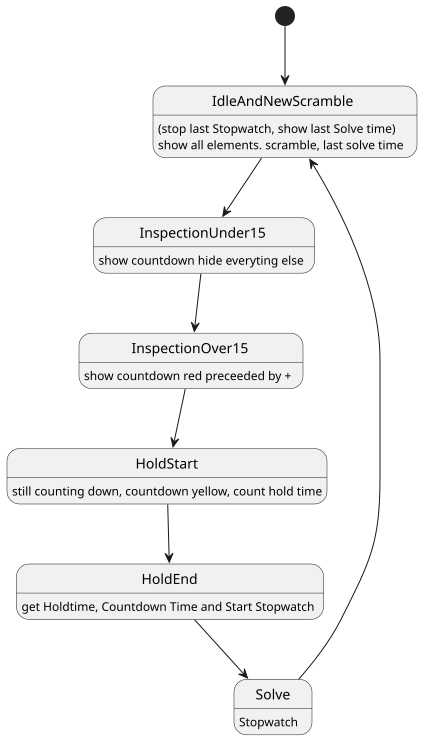
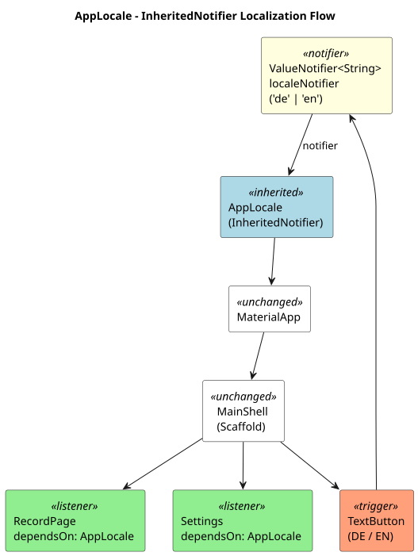
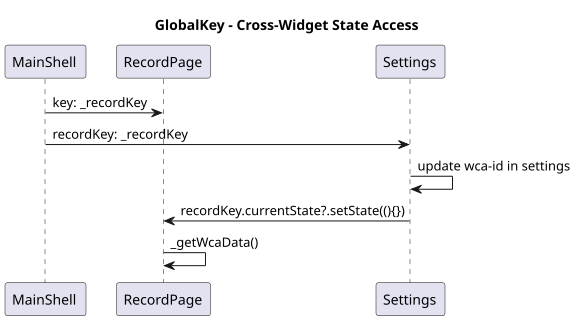

# Usecase – warum Easy2?
- persoenliches Interesse am Prozess: 2x2 hat viele Zufallsloesungen
- einfache Scrambles → One-Looking trainieren (Wettkampf-Scrambles zu lang)
- Timer misst Inspection & Hold gleichzeitig → Datenbasis fuer DNF-Analyse
- CSV-Export: kurze Holds (< 550 ms) = DNF → in Excel/Python auswertbar

---

# Flutter als Vermittler fuer Plattformen
- Embedder vermittelt zwischen App und Plattform – all in one
- ein Codebase → Android, iOS, Desktop

## Dart als typensichere Sprache
- hilft Ueberblick zu halten
- Null Safety: kein unerwartetes null zur Laufzeit

## Widget Tree Hierarchie
```
widget(
  child: widget2(
    child: widget3(...)
  )
)
```
- oft von innen nach aussen entwickelt: `Center(..)` als Wrapper → zentriert

## StatefulWidget & State Machine
- TimerPhase-Enum: `idle → inspection → holdStart → solve`
- `Listener` statt `GestureDetector`: Pointer-Events sofort, kein Delay



## InheritedNotifier
- `AppLocale` auf Top-Level: alle Listener-Widgets darunter updaten automatisch
- `localeNotifier.value = 'de'` → rebuild ohne setState



## GlobalKey
- direkter Zugriff auf State eines anderen Widgets
- Beispiel: WCA-ID in Settings aendern → RecordPage laedt sofort neu



---

# Umgesetzte Features

## API & Fehlerbehandlung (KT3)
- WCA-REST-API: Single & Ao5 laden
- Content-Type-Header pruefen, 404 separat behandelt
- 3 UI-Zustaende: Laden / Fehler / Daten

## Sensor Access (KT4)
- Shake-to-Scramble via Accelerometer-Stream
- Accelerometer = kein Runtime-Permission noetig (non-dangerous sensor)
- on/off Toggle in Settings

## Internationalization
- DE/EN, zur Laufzeit umschaltbar via InheritedNotifier

## Persistenz
- Hive: Session-Tabelle + Einstellungen ueberleben Neustart
- Solve-Zaehler resettet nie → CSV-Zeilen bleiben eindeutig

---

# Technologie

## Theming
- `flex_color_scheme`-Package – inkl. Dev-Template als Ausgangsbasis
- Light & Dark Mode

## Packages (pub.dev)
- `hive_flutter`, `stop_watch_timer`, `shake`, `share_plus`, `http`, `flex_color_scheme`
- `flutter pub add <lib>` und `flutter doctor` – gut durchdacht

---

# Learnings
- Listener > GestureDetector fuer praezise Touch-Messung
- zwei Stopwatches gleichzeitig lesen = atomarer Snapshot
- InheritedNotifier eleganter als setState fuer globalen State

---

# Fazit
- praktisch: all in one, ein Codebase
- logischer und kompakter als HTML/CSS/JS
- viel zu lernen am Anfang – aber wenn man es intus hat, kann man schnell was Gutes machen
- plane Flutter fuer kuenftige Projekte einzusetzen
